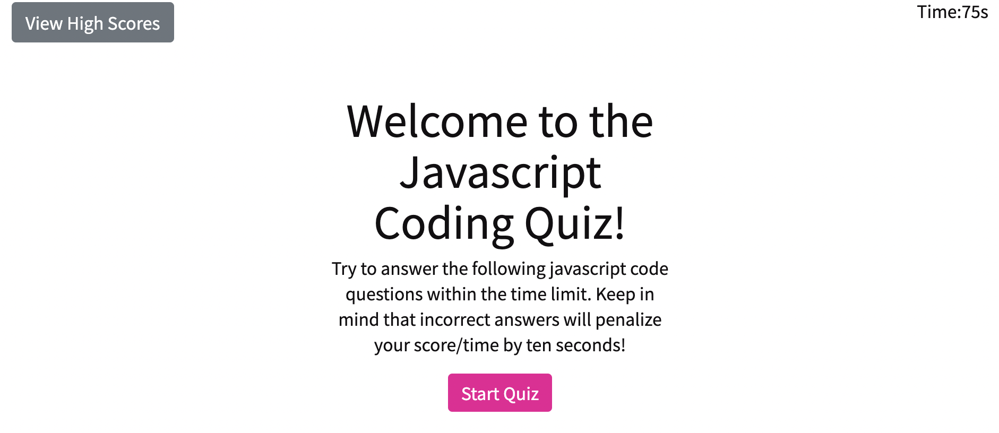
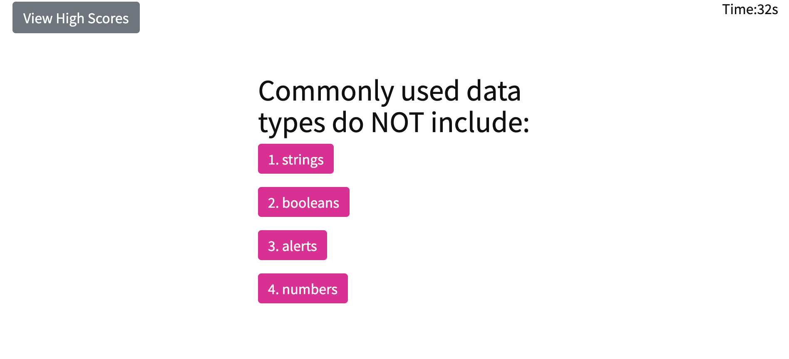
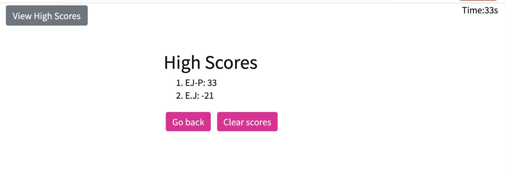

# Javascript Code-Quiz

## Description

This is a timed code quiz, it features multiple-choice questions about javascript. If answered incorrectly, time is deducted.

Link to deployed app: https://emma4jesus.github.io/Javascript-Code-Quiz/

Technologies used are: HTML, CSS, Javascript

Contact: emmanuelajeanbaptiste1@gmail.com

## Screenshots

### Start Quiz section

### Question section

### High scores section

## Honorable Mentions:

- Sticky footer user flexbox from: https://css-tricks.com/couple-takes-sticky-footer/

- CSS media query suggestions from: https://web.dev/optimize-css-background-images-with-media-queries/

- The javascript questions were taken from the example provided.
